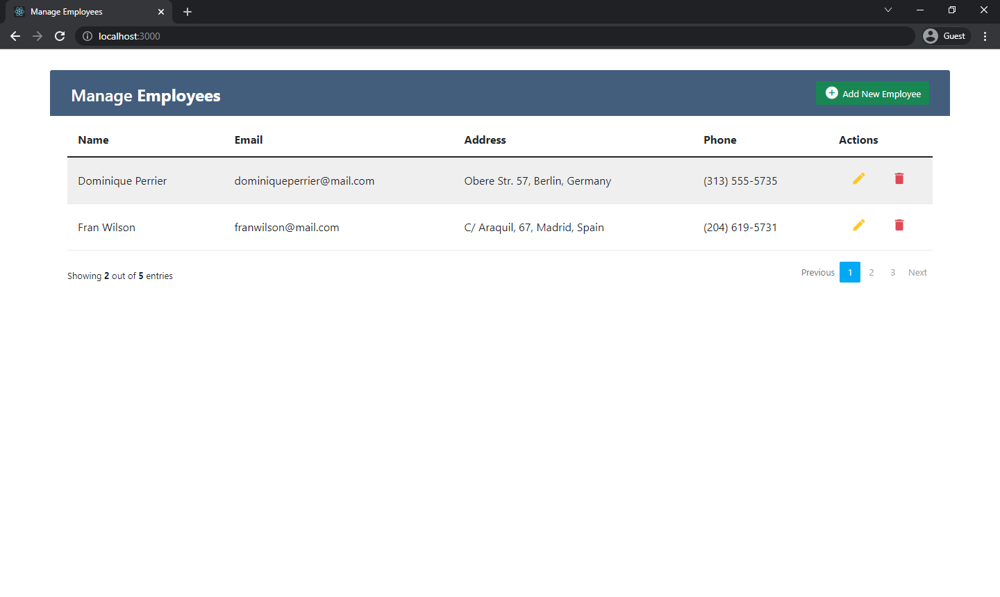
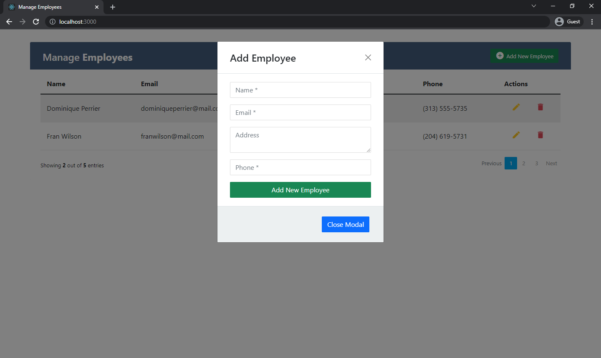

#  MANAGE EMPLOYEE (REACT CRUD OPERATIONS )

This project was created using hooks structure. You can add a new employee to the list or edit and delete any employee. The employee info is kept in local storage. Switching between pages is provided with pagination. Also, Tooltip was added to the project.




## Used Technologies
* 

* 

* 

## Installation
First clone the project.
```
git clone https://github.com/saglamburcu/manage-employees.git
```

## Usage
After cloning the project, open it in Visual Studio Code.
```
cd manage-employees
code .
```
Download node modules to make it work
```
npm install
```
To make it work
```
npm start
```
